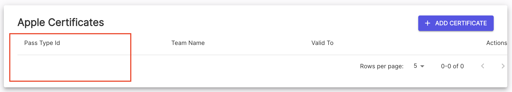
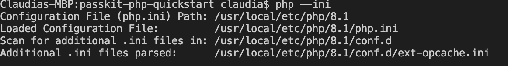
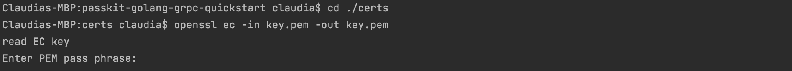
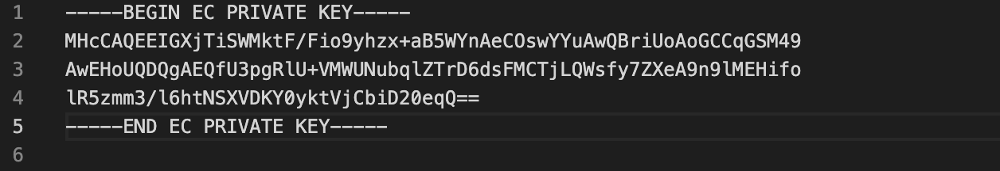
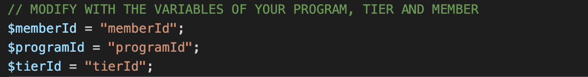

PassKit PHP Quickstart
=======================

### Overview

This quickstart aims to help  get PHP developers up and running with the PassKit SDK as quickly as possible.

### Prerequisites

You will need the following:
- PHP 7.0 or higher [Installation Guide](https://grpc.io/docs/languages/php/quickstart/)
- PEAR [Installation Guide](https://pear.php.net/manual/en/installation.php) 
- PECL [Mac Installation Guide](https://blackdeerdev.com/install-pecl-pear-on-mac-osx/),  [Windows Installation Guide](https://wiki.php.net/internals/windows/stepbystepbuild#building_pecl_extensions)
- Composer [Download Here](https://getcomposer.org/) ([Installation Guide](https://getcomposer.org/download/) )
- A PassKit account (signup for free at [PassKit](https://app.passkit.com))
- Your PassKit SDK Credentials (available from the [Developer Tools Page](https://app.passkit.com/app/account/developer-tools))
- Apple wallet certificate id (for flights only, available from the [certificate page](https://app.passkit.com/app/account/certificates))
 

### Configuration

1.  Install & Enable the gRPC PHP extension

After installing the gRPC extension, make sure the extension is enabled in your `php.ini` file by typing `php --ini`

Make sure that the file has `extension="grpc.so"` and  add the line if it doesn't so it matches the screenshot below:

For detailed steps visit the [gRPC PHP quickstart](https://grpc.io/docs/languages/php/quickstart/).

2. In the certs folder of the repository add the following three PassKit credential files:
    - certificate.pem
    - ca-chain.pem
    - key.pem
    
    You can disregard the key-java.pem credentials file as it is not compatible with PHP.

3. Now we need to decrypt your `key.pem`. At your project root directory, run `cd ./certs`  `openssl ec -in key.pem -out key.pem`.

For the password use the one-time password that you used for generating the SDK credentials.

Your `key.pem` file should look like below.
   
   If you do not see `Proc-Type: 4,ENCEYPTED` on line 2, you have successfully decrypted `key.pem`.
   
4. Modify the variables with the values for your programs or campaigns in each of the membership, coupons and flights methods. The variables to  modify will be at the top of each method.

5. To run each method go into the directory, for  members `cd membership`, for coupons `cd coupons` and for flights `cd flights`. Then run php plus the name of the method e.g. `php enrol-member.php` to run that method.

## Examples
###  Membership Cards
Follow the steps of the [Quickstart](#quickstart) to get the quickstart up and running.
In the membership folder the methods there are:
- create-program.php - takes a new program name and creates a new program
- create-tier.php -  takes the programId of the program just created in the above program, creates a new template (based of default template), creates a tier, and links this tier to the program
- enrol-member.php - takes programId and tierId created by the above methods, and memberDetails, creates a new member record, and sends a welcome email to deliver membership card url
    - GetSingleMember() - takes memberId and returns the record of that member
- list-members.php - takes search conditions as pagination object and returns list of member records which match with the conditions
- update-member.php - takes memberId and memberDetails, and updates existing member record
- earn-points.php - takes a programId of an existing program and memberId of existing member to add points to chosen member
- burn-points.php - takes a programId of an existing program and memberId of existing member to use points from a chosen member
- set-points.php - takes a programId of an existing program and memberId of existing member to set the points of a chosen member
- delete-member.php - takes programId, tierId, memberId and memberDetails, deletes an existing member record

###  Coupons
Follow the steps of the [Quickstart](#quickstart) to get the quickstart up and running.
In the coupons folder the methods are:
- create-campaign.php - takes a new campaign name and creates a new campaign
- create-offer.php - takes a campaignId of the campaign you just created and creates a new template (based of default template), creates an offer, and links this offer to the campaign
- create-coupon.php - takes campaignId and offerId created by the above methods, and couponDetails, creates a new coupon record, and sends a welcome email to deliver coupon card url
- get-single-coupon.php - takes couponId and returns the record of that coupon
- list-coupons.php - takes search conditions as pagination object and returns list of coupon records which match with the conditions
- count-coupons.php - takes search conditions as pagination object and returns the number of coupons who match with the condition
- update-coupon.php - takes a campaignId of an existing campaign and couponId of existing coupon to update that coupon
- redeem-coupon.php - takes a campaignId of an existing campaign and couponId of existing coupon to redeem that coupon
- void-coupon.php - takes the couponId, offerId and campaignId to void an existing coupon
- delete-campaign.php - takes the campaignId to delete an existing campaign

### Boarding Passes
#### Issue A Boarding Pass.
Follow the steps of the [Quickstart](#quickstart) to get the quickstart up and running.
In the flights folder the methods are:
- create-template.php - creates the pass template for flights and boarding passes
- create-carrier.php - takes a new carrier code and creates a new carrier
- create-airport.php - takes a new airport code and creates a new airport.
- create-flight.php - takes templateId , from previous method, to use as base template and uses a carrier code, created from previous method, and creates a new flight
- create-flight-designator.php - creates flight designator using flight code
- create-boarding-pass.php - takes templateId, from previous method, and customer details creates a new boarding pass, and sends a welcome email to deliver boarding pass url
- delete-flight.php - takes an existing flight number as well as other details and deletes the flight associated with it
- delete-flight-designator.php - takes an existing flight designation and deletes the flight designator associated with it
- delete-airports.php - takes an existing airport code and deletes the airport associated with it
- delete-carrier.php - takes an existing carrier code and deletes the carrier associated with it

## Documentation
* [PassKit Membership Official Documentation](https://docs.passkit.io/protocols/member)
* [PassKit Coupons Official Documentation](https://docs.passkit.io/protocols/coupon)
* [PassKit Boarding Passes Official Documentation](https://docs.passkit.io/protocols/boarding)

## Getting Help
* [Online chat support](https://passkit.com/)

